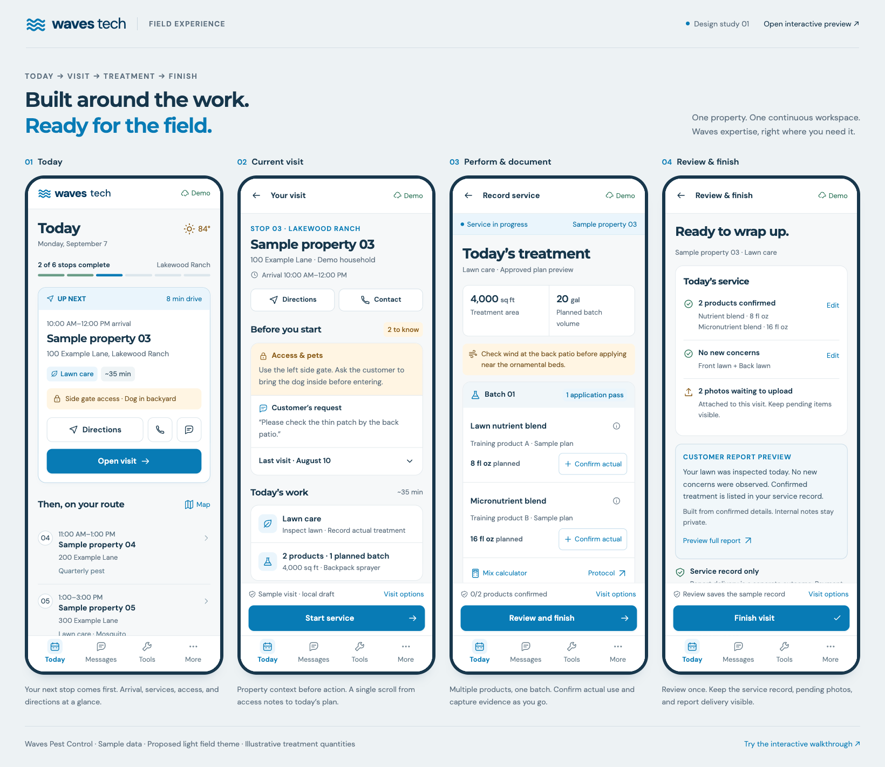
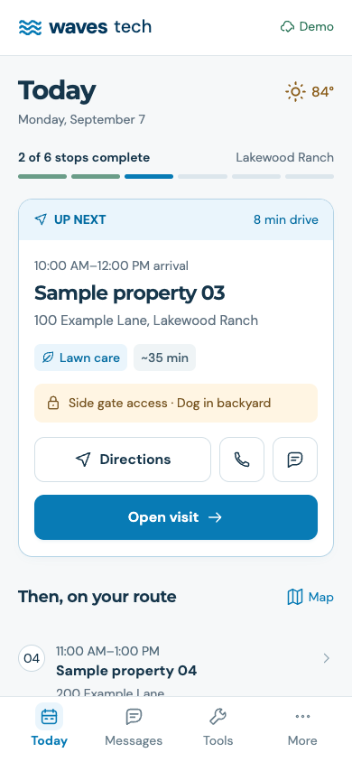
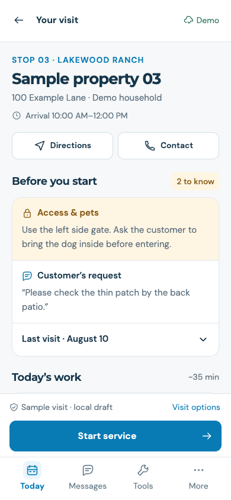
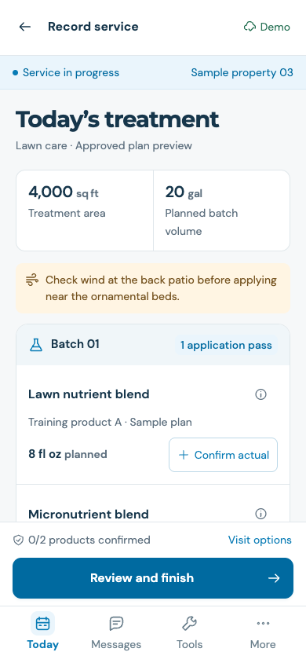
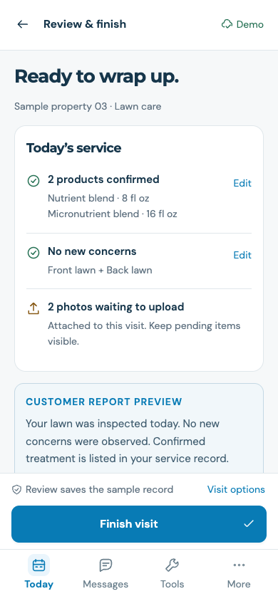
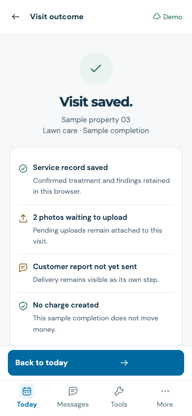

# Waves Tech — Public Design Preview

A proposed mobile technician portal for Waves Pest Control, using fictional properties and illustrative training products.

- [Open the interactive preview](https://wavespestcontrolfl.github.io/waves-tech-design-preview/)
- [Open all screenshots with screen text](https://wavespestcontrolfl.github.io/waves-tech-design-preview/review.html)
- [Read the complete screen text](https://raw.githubusercontent.com/wavespestcontrolfl/waves-tech-design-preview/main/review.txt)
- [Open the design board PNG](https://raw.githubusercontent.com/wavespestcontrolfl/waves-tech-design-preview/main/design-board.png)
- [Download the review PDF](waves-tech-design-review.pdf)

## Workflow

Today → Current visit → Perform and document service → Review and finish.

1. **Today:** next stop, arrival window, service scope, access notes and remaining route.
2. **Current visit:** access and pets, customer request, previous findings and today's work together.
3. **Treatment:** planned products and amounts, actual-use confirmation, treated areas, findings and photos.
4. **Review:** confirmed products and findings, pending photos and a customer report preview.
5. **Completion:** separate service save, upload, report delivery and billing outcomes.

## Screenshots

### Today

[Open this screenshot](https://raw.githubusercontent.com/wavespestcontrolfl/waves-tech-design-preview/main/screenshots/mobile-today-390.png)

### Current visit

[Open this screenshot](https://raw.githubusercontent.com/wavespestcontrolfl/waves-tech-design-preview/main/screenshots/mobile-visit-390.png)

### Perform and document

[Open this screenshot](https://raw.githubusercontent.com/wavespestcontrolfl/waves-tech-design-preview/main/screenshots/mobile-treatment-390.png)

### Review and finish

[Open this screenshot](https://raw.githubusercontent.com/wavespestcontrolfl/waves-tech-design-preview/main/screenshots/mobile-review-390.png)

### Completion

[Open this screenshot](https://raw.githubusercontent.com/wavespestcontrolfl/waves-tech-design-preview/main/screenshots/mobile-completion-390.png)

## Source files

The complete interactive concept is in [index.html](index.html), [style.css](style.css) and [app.js](app.js). The static review is [review.html](review.html), with full screen text in [review.txt](review.txt). No build step is needed.

## Concept scope

Actual photo capture, uploads, offline synchronization and the proposed Messages inbox are simulated. Sample records stay in the viewer's browser. No customer communications, appointment changes or charges occur. Actual treatment requires technician confirmation. Internal notes and access details stay out of customer report previews.
